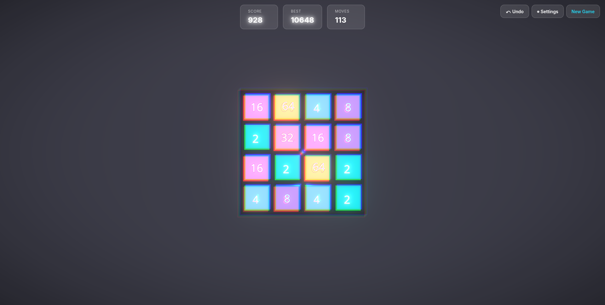

<div align="center">

# 🎮 2048 CYBER GLASS

### *Your childhood game, but make it cyberpunk*

[](https://www.typescriptlang.org/)
[](https://reactjs.org/)
[](https://threejs.org/)
[](https://vitejs.dev/)
[](https://opensource.org/licenses/MIT)

**[Play Live Demo](https://2048.ahadullabaig.in/) • [How It Works](#-how-it-works-for-the-curious)**

---



*2048 but we gave it a glow-up and taught it physics*

</div>

---

## 🔥 Why This Hits Different

### It's Actually 3D
- Real-time **WebGL rendering** with Three.js (not fake 3D with CSS tricks)
- Glassmorphic materials with light refraction (that "frosted glass" effect you see everywhere)
- Bloom effects that make your GPU go brrrr
- Camera shake when you merge big tiles (512+ gets VIOLENT)

### Physics-Based Everything
- Tiles don't just slide—they **spring** with real physics (mass, tension, friction)
- React Spring animations that blend seamlessly when you spam arrow keys
- Particle systems with gravity and velocity (because why not)
- Camera shake intensity scales with merge value (4096 is an experience)

### Sounds Like a Synthwave Album
- **Zero audio files**—all sounds are procedurally generated in real-time
- Higher tiles = higher pitch (logarithmic scaling for that sweet dopamine hit)
- Web Audio API dual oscillators for harmonic richness
- Win/loss jingles that actually slap

### Actually Well-Architected
- Game logic is **pure TypeScript** (zero React deps, 100% testable, framework-agnostic)
- Rotation-based movement algorithm (one function handles all 4 directions—DRY king)
- Undo stack with 10-move history
- Settings persist to localStorage
- Strict TypeScript mode (because we're not animals)

---

## ⚡ Quick Start

**Prerequisites**: Node.js 18+ (that's it)

```bash
git clone https://github.com/ahadullabaig/2048.git
cd 2048
npm install
npm run dev
```

Open `localhost:3000` and prepare for sensory overload 🚀

### Controls
- **Desktop**: Arrow keys (← → ↑ ↓)
- **Mobile**: Swipe like it's 2013 Tinder
- **Undo**: Because we all make mistakes
- **Settings**: Toggle particles, change board size (3×3, 4×4, 5×5)

---

## 🛠️ Built With

<div align="center">


</div>

**The Spicy Bits**:
- **React Three Fiber** (React renderer for Three.js—because `<mesh>` beats imperative code)
- **@react-three/drei** (helpers that save your sanity)
- **@react-three/postprocessing** (bloom, chromatic aberration, all the shader goodness)
- **React Spring** (physics-based animations, not janky CSS transitions)
- **Zustand** (state management that doesn't make you want to flip tables)

---

## 🧠 How It Works (For the Curious)

<details>
<summary><b>🔄 Rotation-Based Movement Algorithm</b></summary>

<br>

Instead of writing 4 separate functions for up/down/left/right, we rotate the board to treat every move as "left", then rotate back:

```typescript
// src/logic/gameLogic.ts:93-141
function move(board: Board, direction: Direction) {
  const rotated = rotateToLeft(board, direction);
  const moved = slideAndMerge(rotated);
  return rotateBack(moved, direction);
}
```

This DRY approach eliminates code duplication while preserving merge coordinates. One function, four directions, zero headaches.

</details>

<details>
<summary><b>🎵 Procedural Audio Synthesis</b></summary>

<br>

All sounds are generated live using the Web Audio API—no MP3s died in the making of this game:

```typescript
// src/utils/audio.ts
// Higher tiles = higher frequency
const frequency = 200 + Math.log2(tileValue) * 80;
oscillator.frequency.value = frequency;
```

Merge sounds use dual oscillators at a perfect fifth interval (`frequency × 1.5`) for harmonic richness. It's like if Daft Punk made a 2048 clone.

</details>

<details>
<summary><b>💎 Glassmorphism Materials</b></summary>

<br>

Tiles use `THREE.MeshPhysicalMaterial` with transmission and refraction for that frosted glass look:

```typescript
// src/theme/materials.ts
{
  transmission: 0.3,       // Glass transparency
  ior: 1.5,                // Index of refraction (realistic glass)
  metalness: 0.1,
  roughness: 0.1,
  emissive: tileColor,     // Inner glow
  emissiveIntensity: 0.5   // Neon vibes
}
```

Combined with bloom postprocessing, it creates that cyberpunk aesthetic that makes your eyes happy.

</details>

<details>
<summary><b>💥 Particle System</b></summary>

<br>

20 particles spawn per merge using instanced meshes for performance:

```typescript
// src/components/Game/Particles.tsx
// Physics-based animation with gravity
position.y += velocity.y * deltaTime;
velocity.y -= gravity * deltaTime;
```

Particles fade out over 0.5s with scale interpolation. Max pool: 500 particles (because we're responsible adults).

</details>

<details>
<summary><b>📸 Camera Shake</b></summary>

<br>

High-value merges trigger camera shake with intensity scaling:

```typescript
// src/hooks/useCameraShake.ts
const shakeIntensity = {
  512: 0.05,
  1024: 0.08,
  2048: 0.12,
  4096: 0.15  // 🫨
};
```

Manual frame-based decay over 300ms. Merging 4096s feels *powerful*.

</details>

---

## 📁 Project Structure

```
src/
├── logic/              ← Pure game logic (zero React deps, fully testable)
├── store/              ← Zustand state (board, settings, undo history)
├── components/
│   ├── Game/           ← 3D scene (tiles, camera, particles, lighting, effects)
│   └── UI/             ← HTML overlay (HUD, controls, modals)
├── hooks/              ← Keyboard, swipe, audio, camera shake
├── theme/              ← Colors, materials, spring configs
└── utils/              ← Web Audio API synthesis
```

**Philosophy**: Strict separation of concerns. Game logic is framework-agnostic, 3D rendering is decoupled from state. You could swap React for Vue tomorrow (but why would you).

See [`CLAUDE.md`](CLAUDE.md) for deep architectural docs (merge prevention, animation timing, lighting setup, etc.).

---

## 🚀 Development

### Commands

```bash
npm run dev      # Start dev server (localhost:3000)
npm run build    # Production build (TypeScript check + Vite bundle)
npm run preview  # Preview production build
npm run lint     # Type-check only (no emit)
```

### Common Modifications

- 🎨 **Change colors**: `src/theme/colors.ts` (tile colors, glow, environment)
- 🎵 **Tweak audio**: `src/utils/audio.ts` (frequencies, oscillator types)
- ⚙️ **Add board size**: Update `BOARD_SIZES` in `src/logic/constants.ts`
- ✨ **New postprocessing effects**: Add to `<EffectComposer>` in `src/components/Game/Effects.tsx`
- 🔧 **Spring physics**: Edit `SPRING_CONFIGS` in `src/theme/animations.ts`

**Hot reload works for**: Logic changes, state updates, UI components, hooks
**Requires refresh for**: Material changes, geometry modifications, shader updates

---

## ⚡ Performance & Browser Support

### Performance
- **60fps** on modern devices (tested on M1 Mac, iPhone 13+)
- **~970KB** initial bundle (mostly Three.js, which is standard for 3D web)
- **Sub-100ms** time-to-interactive
- **WebGL 2.0** required for postprocessing effects

### Browser Support
**Works on**: Chrome 90+, Firefox 88+, Safari 14+, Edge 90+, all modern mobile browsers

*Low-end device? Disable particles in settings for butter-smooth 60fps.*

---

## 🎯 Game Rules

1. Use arrow keys (desktop) or swipe (mobile) to move tiles
2. Tiles with the same number merge when they touch
3. Each move spawns a new tile (90% chance of 2, 10% chance of 4)
4. Reach **2048** to win (but you can keep playing!)
5. Game ends when no valid moves remain

**Pro tip**: The rotation algorithm means merges feel consistent in all directions. No weird edge cases.

---

## 💝 Support This Project

If this gave you ideas, made you go "wait, how?", or just made you smile:

- ⭐ **Star this repo** (it feeds my dopamine receptors)
- 🐦 **Share it**
- 🐛 **Open issues** (but be nice, I have feelings)

---

## License

MIT © [Ahad](https://github.com/ahadullabaig)

Go wild, build cool stuff, just credit me when you make it big 🚀

---

## Credits

- **Original 2048**: [Gabriele Cirulli](https://github.com/gabrielecirulli/2048)
- **This Cyberpunk Madness**: Ahad
- **Inspiration**: Synthwave aesthetics, glassmorphism trends, and way too much caffeine

---

<div align="center">

### Built with care, caffeine, and way too much bloom effect ✨

</div>
